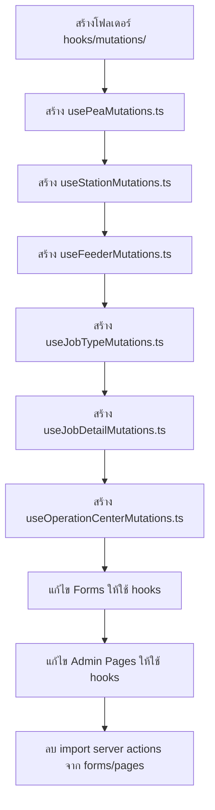
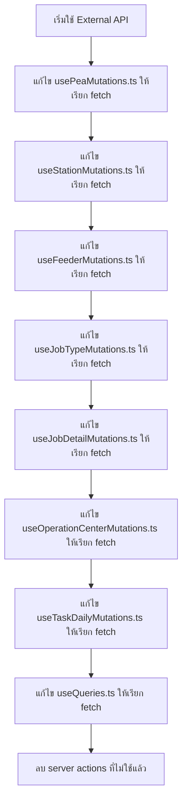

# Plan V2: Refactor Server Actions → Custom Hooks

> **Created**: 2026-02-01
> **Objective**: แปลง Server Actions เป็น Custom Hooks เพื่อให้สามารถเปลี่ยนเป็น External API ได้ง่ายในอนาคต โดยเมื่อเปลี่ยนเป็น External API จะแก้ที่ hooks เพียงที่เดียว

> **Important**: ไม่ได้สร้าง Next.js API Routes แต่เตรียม hooks ให้สามารถเปลี่ยนไปเรียก External API ได้ในอนาคต

---

## Table of Contents
1. [แนวทางการ Refactor](#1-แนวทางการ-refactor)
2. [สถาปัตยกรรมใหม่](#2-สถาปัตยกรรมใหม่)
3. [Custom Hooks ที่ต้องสร้าง](#3-custom-hooks-ที่ต้องสร้าง)
4. [หน้าที่ต้องแก้ไข](#4-หน้าที่ต้องแก้ไข)
5. [//TODO Comments](#5-todo-comments-สำหรับแต่ละไฟล์)
6. [ลำดับการดำเนินงาน](#6-ลำดับการดำเนินงาน)
7. [การเปลี่ยนเป็น External API ในอนาคต](#7-การเปลี่ยนเป็น-external-api-ในอนาคต)

---

## 1. แนวทางการ Refactor

### หลักการ
1. **ไม่เรียก Server Action โดยตรงในหน้าหรือ Form** - ใช้ Custom Hook แทน
2. **1 Entity = 1 Hook file** - เช่น `useOperationCenterMutations.ts` สำหรับ CRUD operations
3. **Query hooks แยกจาก Mutation hooks** - Query อยู่ใน `useQueries.ts`, Mutations ใน hooks แยก
4. **เมื่อเปลี่ยนเป็น External API** - แก้เฉพาะใน hook functions เท่านั้น
5. **ไม่สร้าง Next.js API Routes** - จะใช้ External API ในอนาคต ไม่ใช่ API ของ Next.js

### Before (ปัจจุบัน)
```
Component → Server Action (โดยตรง)
```

### After (เป้าหมาย)
```
Component → Custom Hook (useMutation) → Server Action → Prisma
                     ↓
    (อนาคต: เปลี่ยนเป็น External API เพียงแก้ที่ hook)
                     ↓
Component → Custom Hook (useMutation) → fetch() → External API
```

---

## 2. สถาปัตยกรรมใหม่

### Directory Structure
```
src/hooks/
├── useQueries.ts              # (มีอยู่แล้ว) Query hooks สำหรับดึงข้อมูล
├── useUpload.ts               # (มีอยู่แล้ว) Upload hook
├── use-media-query.ts         # (มีอยู่แล้ว)
│
├── mutations/                 # [NEW] โฟลเดอร์ใหม่สำหรับ mutation hooks
│   ├── usePeaMutations.ts
│   ├── useStationMutations.ts
│   ├── useFeederMutations.ts
│   ├── useJobTypeMutations.ts
│   ├── useJobDetailMutations.ts
│   ├── useOperationCenterMutations.ts
│   ├── useTeamMutations.ts
│   └── useTaskDailyMutations.ts   # (แยกจาก useQueries.ts)
│
└── index.ts                   # [NEW] Re-export ทุก hooks
```

---

## 3. Custom Hooks ที่ต้องสร้าง

### 3.1 `usePeaMutations.ts`
| Hook Function | รับจาก | ใช้ใน | Server Action |
|---------------|--------|-------|---------------|
| `useCreatePea()` | data: CreatePeaData | PeaForm, BulkPeaForm | `createPea()` |
| `useUpdatePea()` | data: UpdatePeaData | PeaForm | `updatePea()` |
| `useDeletePea()` | id: string | admin/peas/page.tsx | `deletePea()` |
| `useCreateMultiplePeas()` | data[] | BulkPeaForm | `createMultiplePeas()` |

### 3.2 `useStationMutations.ts`
| Hook Function | รับจาก | ใช้ใน | Server Action |
|---------------|--------|-------|---------------|
| `useCreateStation()` | data: CreateStationData | StationForm | `createStation()` |
| `useUpdateStation()` | data: UpdateStationData | StationForm | `updateStation()` |
| `useDeleteStation()` | id: string | admin/stations/page.tsx | `deleteStation()` |

### 3.3 `useFeederMutations.ts`
| Hook Function | รับจาก | ใช้ใน | Server Action |
|---------------|--------|-------|---------------|
| `useCreateFeeder()` | data: CreateFeederData | FeederForm | `createFeeder()` |
| `useUpdateFeeder()` | data: UpdateFeederData | FeederForm | `updateFeeder()` |
| `useDeleteFeeder()` | id: string | admin/feeders/page.tsx | `deleteFeeder()` |

### 3.4 `useJobTypeMutations.ts`
| Hook Function | รับจาก | ใช้ใน | Server Action |
|---------------|--------|-------|---------------|
| `useCreateJobType()` | data: CreateJobTypeData | JobTypeForm | `createJobType()` |
| `useUpdateJobType()` | data: UpdateJobTypeData | JobTypeForm | `updateJobType()` |
| `useDeleteJobType()` | id: string | admin/job-types/page.tsx | `deleteJobType()` |

### 3.5 `useJobDetailMutations.ts`
| Hook Function | รับจาก | ใช้ใน | Server Action |
|---------------|--------|-------|---------------|
| `useCreateJobDetail()` | data: CreateJobDetailData | JobDetailForm | `createJobDetail()` |
| `useUpdateJobDetail()` | data: UpdateJobDetailData | JobDetailForm | `updateJobDetail()` |
| `useDeleteJobDetail()` | id: string | admin/job-details/page.tsx | `deleteJobDetail()` |

### 3.6 `useOperationCenterMutations.ts`
| Hook Function | รับจาก | ใช้ใน | Server Action |
|---------------|--------|-------|---------------|
| `useCreateOperationCenter()` | data: CreateOperationCenterData | OperationCenterForm | `createOperationCenter()` |
| `useUpdateOperationCenter()` | data: UpdateOperationCenterData | OperationCenterForm | `updateOperationCenter()` |
| `useDeleteOperationCenter()` | id: string | admin/operation-centers/page.tsx | `deleteOperationCenter()` |

### 3.7 `useTeamMutations.ts`
| Hook Function | รับจาก | ใช้ใน | Server Action |
|---------------|--------|-------|---------------|
| `useCreateTeam()` | data | (ถ้ามี TeamForm) | `createTeam()` |
| `useUpdateTeam()` | data | (ถ้ามี TeamForm) | `updateTeam()` |
| `useDeleteTeam()` | id | (ถ้ามี) | `deleteTeam()` |

### 3.8 `useTaskDailyMutations.ts` (แยกจาก useQueries.ts)
> **Note**: hooks นี้มีอยู่แล้วใน `useQueries.ts` (useCreateTaskDaily, useUpdateTaskDaily, useDeleteTaskDaily) แต่ควรแยก file

---

## 4. หน้าที่ต้องแก้ไข

### 4.1 Form Components (เรียก create/update โดยตรง)

#### `pea-form.tsx`
- **Line 9**: `import { createPea, updatePea } from '@/lib/actions/pea'`
- **Line 40-41**: `await updatePea(...)` และ `await createPea(...)`
- **เปลี่ยนเป็น**: ใช้ `useCreatePea()` และ `useUpdatePea()` จาก hooks

#### `bulk-pea-form.tsx`
- **Line 8**: `import { createMultiplePeas } from '@/lib/actions/pea'`
- **เปลี่ยนเป็น**: ใช้ `useCreateMultiplePeas()` จาก hooks

#### `station-form.tsx`
- **Line 9**: `import { createStation, updateStation } from '@/lib/actions/station'`
- **เปลี่ยนเป็น**: ใช้ `useCreateStation()` และ `useUpdateStation()` จาก hooks

#### `feeder-form.tsx`
- **Line 9**: `import { createFeeder, updateFeeder } from '@/lib/actions/feeder'`
- **เปลี่ยนเป็น**: ใช้ `useCreateFeeder()` และ `useUpdateFeeder()` จาก hooks

#### `job-type-form.tsx`
- **Line 8**: `import { createJobType, updateJobType } from '@/lib/actions/job-type'`
- **เปลี่ยนเป็น**: ใช้ `useCreateJobType()` และ `useUpdateJobType()` จาก hooks

#### `job-detail-form.tsx`
- **Line 8**: `import { createJobDetail, updateJobDetail } from '@/lib/actions/job-detail'`
- **เปลี่ยนเป็น**: ใช้ `useCreateJobDetail()` และ `useUpdateJobDetail()` จาก hooks

#### `operation-center-form.tsx`
- **Line 8**: `import { createOperationCenter, updateOperationCenter } from '@/lib/actions/operation-center'`
- **เปลี่ยนเป็น**: ใช้ `useCreateOperationCenter()` และ `useUpdateOperationCenter()` จาก hooks

---

### 4.2 Admin Pages (เรียก delete โดยตรง)

#### `admin/peas/page.tsx`
- **Line 9**: `import { deletePea } from '@/lib/actions/pea'`
- **Line 34**: `await deletePea(id)` ใน `handleDelete()`
- **เปลี่ยนเป็น**: ใช้ `useDeletePea().mutateAsync(id)` จาก hooks

#### `admin/stations/page.tsx`
- **Line 8**: `import { deleteStation } from '@/lib/actions/station'`
- **เปลี่ยนเป็น**: ใช้ `useDeleteStation()` จาก hooks

#### `admin/feeders/page.tsx`
- **Line 8**: `import { deleteFeeder } from '@/lib/actions/feeder'`
- **เปลี่ยนเป็น**: ใช้ `useDeleteFeeder()` จาก hooks

#### `admin/job-types/page.tsx`
- **Line 8**: `import { deleteJobType } from '@/lib/actions/job-type'`
- **เปลี่ยนเป็น**: ใช้ `useDeleteJobType()` จาก hooks

#### `admin/job-details/page.tsx`
- **Line 9**: `import { deleteJobDetail } from '@/lib/actions/job-detail'`
- **เปลี่ยนเป็น**: ใช้ `useDeleteJobDetail()` จาก hooks

#### `admin/operation-centers/page.tsx`
- **Line 8**: `import { deleteOperationCenter } from '@/lib/actions/operation-center'`
- **เปลี่ยนเป็น**: ใช้ `useDeleteOperationCenter()` จาก hooks

---

### 4.3 Hooks File (เรียก Server Actions ใน queryFn/mutationFn)

#### `useQueries.ts`

**Query Hooks** (Lines 43-139) - เรียก server actions โดยตรง:
| Hook | Line | Server Action | เปลี่ยนเป็น (อนาคต) |
|------|------|---------------|-----------|
| `useJobDetails()` | 47-53 | `getJobDetails()` | fetch() ไปยัง External API |
| `useFeeders()` | 61-67 | `getFeeders()` | fetch() ไปยัง External API |
| `usePeas()` | 75-81 | `getPeas()` | fetch() ไปยัง External API |
| `useStations()` | 89-95 | `getStations()` | fetch() ไปยัง External API |
| `useJobTypes()` | 103-109 | `getJobTypes()` | fetch() ไปยัง External API |
| `useOperationCenters()` | 117-123 | `getOperationCenters()` | fetch() ไปยัง External API |
| `useTeams()` | 131-137 | `getTeams()` | fetch() ไปยัง External API |
| `useTaskDailies()` | 245-252 | `getTaskDailiesByFilter()` | fetch() ไปยัง External API |

**Mutation Hooks** (Lines 258-326) - เรียก server actions โดยตรง:
| Hook | Line | Server Action | เปลี่ยนเป็น (อนาคต) |
|------|------|---------------|-----------|
| `useCreateTaskDaily()` | 263-269 | `createTaskDaily()` | fetch POST ไปยัง External API |
| `useUpdateTaskDaily()` | 287-293 | `updateTaskDaily()` | fetch PATCH ไปยัง External API |
| `useDeleteTaskDaily()` | 310-316 | `deleteTaskDaily()` | fetch DELETE ไปยัง External API |

---

## 5. //TODO Comments สำหรับแต่ละไฟล์

ให้เพิ่ม comment `//TODO:` ในไฟล์ต่อไปนี้เพื่อระบุว่าต้องแก้อะไรบ้าง:

### Forms

```typescript
// pea-form.tsx (Line 9)
// TODO: [REFACTOR] เปลี่ยนจาก import server action เป็นใช้ useCreatePea(), useUpdatePea() hooks
// TODO: [EXTERNAL-API] อนาคต: แก้ไข hooks ให้เรียก External API แทน server actions

// bulk-pea-form.tsx (Line 8)
// TODO: [REFACTOR] เปลี่ยนจาก import server action เป็นใช้ useCreateMultiplePeas() hook
// TODO: [EXTERNAL-API] อนาคต: แก้ไข hooks ให้เรียก External API แทน server actions

// station-form.tsx (Line 9)
// TODO: [REFACTOR] เปลี่ยนจาก import server action เป็นใช้ useCreateStation(), useUpdateStation() hooks
// TODO: [EXTERNAL-API] อนาคต: แก้ไข hooks ให้เรียก External API แทน server actions

// feeder-form.tsx (Line 9)
// TODO: [REFACTOR] เปลี่ยนจาก import server action เป็นใช้ useCreateFeeder(), useUpdateFeeder() hooks
// TODO: [EXTERNAL-API] อนาคต: แก้ไข hooks ให้เรียก External API แทน server actions

// job-type-form.tsx (Line 8)
// TODO: [REFACTOR] เปลี่ยนจาก import server action เป็นใช้ useCreateJobType(), useUpdateJobType() hooks
// TODO: [EXTERNAL-API] อนาคต: แก้ไข hooks ให้เรียก External API แทน server actions

// job-detail-form.tsx (Line 8)
// TODO: [REFACTOR] เปลี่ยนจาก import server action เป็นใช้ useCreateJobDetail(), useUpdateJobDetail() hooks
// TODO: [EXTERNAL-API] อนาคต: แก้ไข hooks ให้เรียก External API แทน server actions

// operation-center-form.tsx (Line 8)
// TODO: [REFACTOR] เปลี่ยนจาก import server action เป็นใช้ useCreateOperationCenter(), useUpdateOperationCenter() hooks
// TODO: [EXTERNAL-API] อนาคต: แก้ไข hooks ให้เรียก External API แทน server actions
```

### Admin Pages

```typescript
// admin/peas/page.tsx (Line 9)
// TODO: [REFACTOR] เปลี่ยนจาก import deletePea เป็นใช้ useDeletePea() hook
// TODO: [REFACTOR] แก้ handleDelete ให้ใช้ mutation.mutateAsync(id) แทน await deletePea(id)
// TODO: [UX] เปลี่ยนจาก confirm() เป็น AlertDialog component

// admin/stations/page.tsx
// TODO: [REFACTOR] เปลี่ยนจาก import deleteStation เป็นใช้ useDeleteStation() hook
// TODO: [REFACTOR] แก้ handleDelete ให้ใช้ mutation.mutateAsync(id)
// TODO: [UX] เปลี่ยนจาก confirm() เป็น AlertDialog component

// admin/feeders/page.tsx
// TODO: [REFACTOR] เปลี่ยนจาก import deleteFeeder เป็นใช้ useDeleteFeeder() hook
// TODO: [REFACTOR] แก้ handleDelete ให้ใช้ mutation.mutateAsync(id)
// TODO: [UX] เปลี่ยนจาก confirm() เป็น AlertDialog component

// admin/job-types/page.tsx
// TODO: [REFACTOR] เปลี่ยนจาก import deleteJobType เป็นใช้ useDeleteJobType() hook
// TODO: [REFACTOR] แก้ handleDelete ให้ใช้ mutation.mutateAsync(id)
// TODO: [UX] เปลี่ยนจาก confirm() เป็น AlertDialog component

// admin/job-details/page.tsx
// TODO: [REFACTOR] เปลี่ยนจาก import deleteJobDetail เป็นใช้ useDeleteJobDetail() hook
// TODO: [REFACTOR] แก้ handleDelete ให้ใช้ mutation.mutateAsync(id)
// TODO: [UX] เปลี่ยนจาก confirm() เป็น AlertDialog component

// admin/operation-centers/page.tsx
// TODO: [REFACTOR] เปลี่ยนจาก import deleteOperationCenter เป็นใช้ useDeleteOperationCenter() hook
// TODO: [REFACTOR] แก้ handleDelete ให้ใช้ mutation.mutateAsync(id)
// TODO: [UX] เปลี่ยนจาก confirm() เป็น AlertDialog component
```

### Hooks

```typescript
// useQueries.ts (Lines 4-20)
// TODO: [EXTERNAL-API] อนาคต: แก้ไข query hooks ทั้งหมดให้เรียก External API แทน server actions
// TODO: [REFACTOR] แยก mutation hooks (useCreateTaskDaily, useUpdateTaskDaily, useDeleteTaskDaily) ไปไฟล์ useTaskDailyMutations.ts

// useQueries.ts (Lines 47-53, 61-67, 75-81, 89-95, 103-109, 117-123, 131-137)
// TODO: [EXTERNAL-API] อนาคต: Query hooks - เปลี่ยนจากเรียก server action เป็น fetch() ไปยัง External API

// useQueries.ts (Lines 263-316)
// TODO: [EXTERNAL-API] อนาคต: Mutation hooks - เปลี่ยนจากเรียก server action เป็น fetch() ไปยัง External API
```

---

## 6. ลำดับการดำเนินงาน

### Phase 1: สร้าง Mutation Hooks (ใช้ Server Actions)



### Phase 2: เปลี่ยนเป็น External API (เมื่อพร้อม)



---

## 7. การเปลี่ยนเป็น External API ในอนาคต

### ตัวอย่างการแก้ไข Hook เมื่อเปลี่ยนเป็น External API

#### ตัวอย่าง: `usePeaMutations.ts`

**ปัจจุบัน (ใช้ Server Action):**
```typescript
import { useMutation, useQueryClient } from '@tanstack/react-query';
import { createPea, updatePea, deletePea } from '@/lib/actions/pea';
import { toast } from 'sonner';

export function useCreatePea() {
  const queryClient = useQueryClient();

  return useMutation({
    mutationFn: async (data: CreatePeaData) => {
      return await createPea(data); // Server Action
    },
    onSuccess: () => {
      queryClient.invalidateQueries({ queryKey: ['peas'] });
      toast.success('สร้าง PEA สำเร็จ');
    },
    onError: (error) => {
      toast.error('เกิดข้อผิดพลาด: ' + error.message);
    },
  });
}
```

**อนาคต (ใช้ External API):**
```typescript
import { useMutation, useQueryClient } from '@tanstack/react-query';
import { toast } from 'sonner';

export function useCreatePea() {
  const queryClient = useQueryClient();

  return useMutation({
    mutationFn: async (data: CreatePeaData) => {
      const response = await fetch('https://external-api.com/peas', {
        method: 'POST',
        headers: { 'Content-Type': 'application/json' },
        body: JSON.stringify(data),
      });
      if (!response.ok) throw new Error('Failed to create pea');
      return response.json();
    },
    onSuccess: () => {
      queryClient.invalidateQueries({ queryKey: ['peas'] });
      toast.success('สร้าง PEA สำเร็จ');
    },
    onError: (error) => {
      toast.error('เกิดข้อผิดพลาด: ' + error.message);
    },
  });
}
```

### ขั้นตอนการเปลี่ยนเป็น External API

1. **แก้ไขแต่ละ Mutation Hook** ใน `hooks/mutations/*.ts`
   - เปลี่ยนจากเรียก server action เป็น `fetch()` ไปยัง External API
   - ปรับ data format ตามที่ External API ต้องการ

2. **แก้ไข Query Hooks** ใน `hooks/useQueries.ts`
   - เปลี่ยนจากเรียก server action เป็น `fetch()` ไปยัง External API
   - ปรับ response format ตามที่ External API ส่งกลับมา

3. **ทดสอบการทำงาน** ทั้ง create, update, delete, และ query

4. **ลบ Server Actions** ที่ไม่ใช้แล้ว (ถ้าแน่ใจว่าไม่ต้องใช้)

### ข้อดีของการใช้ Custom Hooks

- **แก้ที่เดียว**: เมื่อเปลี่ยนเป็น External API แก้เฉพาะใน hooks เท่านั้น
- **Components ไม่กระทบ**: Forms และ Admin Pages ไม่ต้องแก้ไข
- **Consistency**: ทุกการเรียก API ผ่าน hooks มี error handling และ toast notifications เหมือนกัน
- **Easy Testing**: สามารถ mock hooks ได้ง่ายใน unit tests

---

## สรุปไฟล์ที่ต้องแก้

| ประเภท | ไฟล์ | การเปลี่ยนแปลง |
|--------|------|---------------|
| **Forms** (7 files) | pea-form, station-form, feeder-form, job-type-form, job-detail-form, operation-center-form, bulk-pea-form | เปลี่ยนจากเรียก server action เป็นใช้ mutation hooks |
| **Admin Pages** (6 files) | peas, stations, feeders, job-types, job-details, operation-centers | เปลี่ยน delete action เป็นใช้ mutation hooks |
| **Hooks** (1 file) | useQueries.ts | แยก mutations ออกไปไฟล์ใหม่ + เตรียมเปลี่ยนเป็น External API |
| **New Hooks** (7 files) | usePeaMutations, useStationMutations, useFeederMutations, useJobTypeMutations, useJobDetailMutations, useOperationCenterMutations, useTeamMutations | สร้างใหม่ |

**รวม: 21 files** (14 แก้ไข + 7 สร้างใหม่)

---

> **หมายเหตุสำคัญ**: เมื่อ implement เสร็จ เวลาเปลี่ยนไปใช้ External API จะแก้แค่ใน `hooks/mutations/*.ts` และ `hooks/useQueries.ts` เท่านั้น ไม่ต้องแก้ไข Forms หรือ Admin Pages อีก

---

> **หมายเหตุสำคัญ**: เมื่อ implement เสร็จ เวลาเปลี่ยนไปใช้ API จะแก้แค่ใน `hooks/mutations/*.ts` files เท่านั้น ไม่ต้องแก้ไข Forms หรือ Admin Pages อีก
